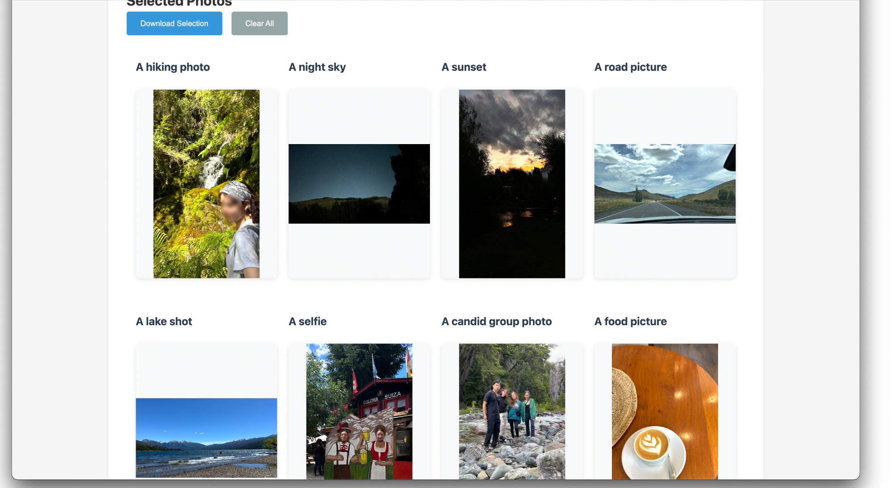

# AI Photo Dump Helper

## Description

AI Photo Dump is a web application designed to help you curate photo albums using AI. It allows you to upload a folder of images, specify desired 'photdump' ideas, and then processes the images to select the best ones for each category/ideas. The application runs locally on macOS.

**Example** of the AI Photo Dump Helper:




## How to Run

1. **Clone the repository**

```bash
$ git clone https://github.com/noehsueh/ai-photodump.git
$ cd ai-photodump-
```

2. **Install dependencies**

Create an enviroment with Python 3.11. Then, install the required dependencies:

```bash
$ pip install -r requirements.txt
```

3. **Start the application**

```bash
python main.py
```

4. **Open your web browser**

Navigate to `http://localhost:8000` to access the application.

## How to use

1. **Upload Photos**: Drag and drop photos or select a folder of images to upload.
2. **Specify Categories**: Enter a list of desired categories for the photo dump. For example:
```
A beach or lake shot
A candid group photo
Local food or drink
An outfit picture
An action shot (hiking, swimming, etc.)
A funny or imperfect shot
Polaroid or film-style capture
A night picture
```

3. **Processing**: The application uses AI to analyze and categorize the photos based on the specified categories. [see below for how it works]
4. **Results**: View the selected photos for each category. You can download the selected photos as a ZIP file.

## Note

Currently, the application only works on macOS.

----
**Motivation**. I have tons of photos and I want to create a photodump to summarize an album in a playful way. Basically I want to select a few photos based on a prompt and create an instagram style photodump from that. 

*Problem formulation*

Given an album of $N$ photos, select $k$ photos where $k <<< N$ based on a prompt prompt $p$. For now, assume $p$ is a **list** of pictures ideas for the photodump. E.g.
Let the prompt $p$ be: Select pictures for a photodump containing

1. A beach or lake shot
2. A candid group photo
3. Local food or drink
4. An outfit picture
5. An action shot (hiking, swimming, etc.)
6. A funny or imperfect shot
7. A cozy café or unique restaurant setting
8. Polaroid or film-style capture
9. A night picture
10. A quirky or unexpected moment
11. A close-up shot

Then the model should select $k \leq 11$ pictures from the album matching the prompt description. Note that some images might not exists in the album. In that case it might be skipped.

## Solution Implementation

The `cli.py` script implements a pipeline to select photos for a photo dump based on a list of prompts. Here's how it works:

1. First, it loads all photos from a specified album directory and processes them in batches using BLIP (Image Captioning Model). For each photo, I use to BLIP analyzes the image and assigns it to one of the predefined categories. 
2. For each category in the list, we collect all photos that match that category, sorted by the model's "probability" score. This gives us separate lists of candidate photos for each category (e.g., all ranked beach photos ranked).
3. For the remaining candidate photos in each category, the script computes two scores:
   - A CLIP similarity score measuring how well the photo matches its category description
   - An aesthetic quality score using a fine-tuned MLP model trained on human aesthetic ratings
4. The photos are ranked by combining these scores, and the top-scoring photo for each prompt category is selected for the final photo dump. 

The script outputs both the selected photos (copied to an output directory) and a JSON file mapping each chosen photo to its corresponding prompt category and scores.
